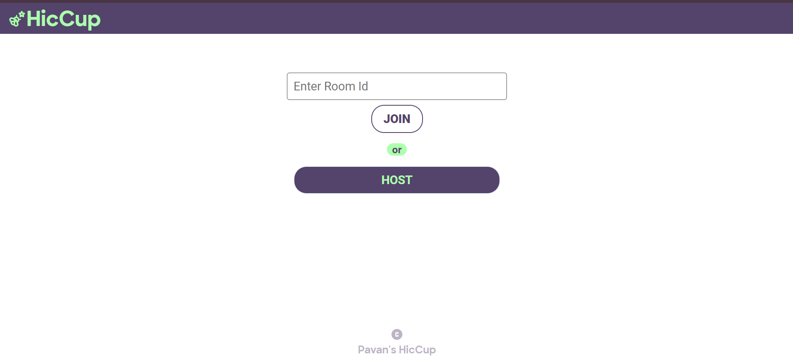
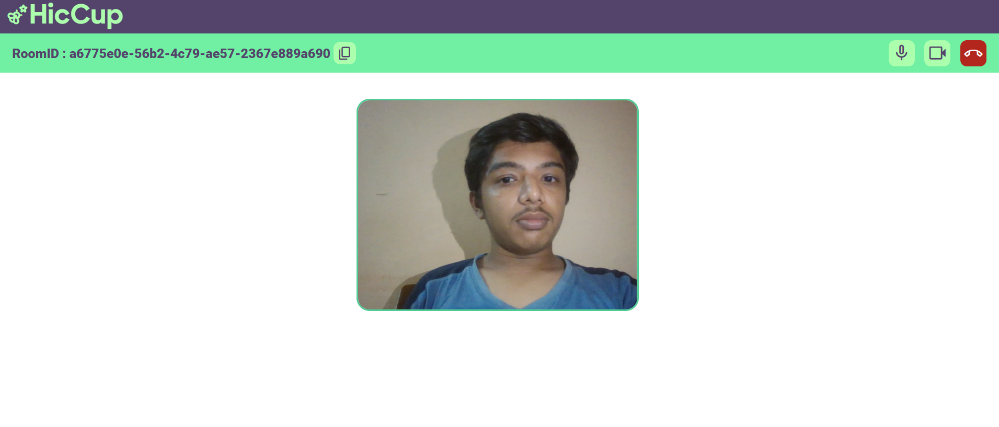
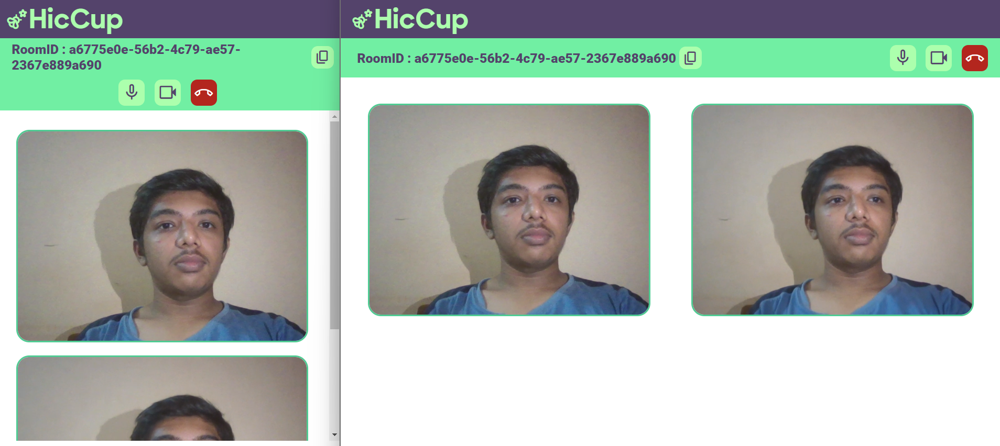

# Hiccup | Video Conference Web Application 

## Overview:
Hiccup is a peer-to-peer video conferencing application designed to facilitate seamless real-time communication.

## Key Features:
- Peer-to-Peer Video Conferencing: Uses WebRTC for direct video and audio communication between users.
- Real-Time Communication: Implements Socket.io for signaling and managing connections.
- Secure and Efficient: Ensures low-latency, high-quality video calls with minimal setup.

## Technologies Used:
- WebRTC
- Socket.io

Note: This is an educational purpose website, as students of undergraduate we are learning about socket programming and webrtc.

# Preview

